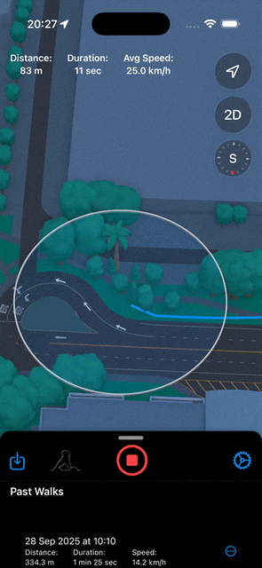
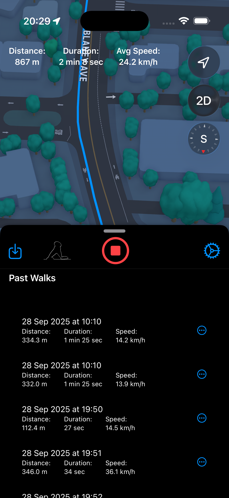
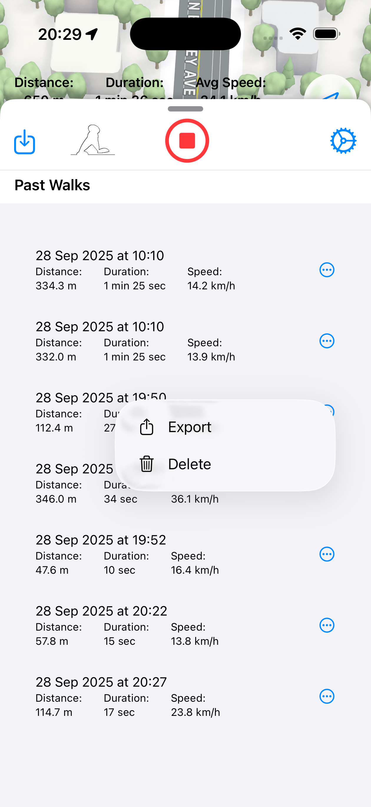

# 🚶‍♂️ WalkingRecords

A personal walking & running tracker built with SwiftUI, featuring route tracking, statistics, and modern iOS technologies.

## 📸 Screenshots

<div align="center">
  
  
  
</div>

## ✨ Features

**🚶‍♀️ Route Tracking**: Record walking, running, or cycling routes with GPS accuracy.

**🗺 Map Integration**: Display paths on interactive maps using MapKit with Swift 6 concurrency.

**📊 Real-time Statistics**: Calculate distance, average speed, and duration with live updates.

**💾 Data Persistence**: Store workouts using SwiftData with modern concurrency support.

**📂 GPX Support**: Export and import workouts as GPX files.

**🎞 Smooth Animations**: Metal-based walking animation during tracking with optimized performance.

**🧪 Demo Mode**: Debug mode using included Location.gpx for testing.

**🌗 Theme Support**: Light and Dark mode with system-adaptive interfaces.

## 🛠 Tech Stack

- **Swift 6.0+** - Latest Swift language features and concurrency model
- **SwiftUI** - Modern declarative UI framework with animations and widgets
- **The Composable Architecture (TCA)** - Modular, testable state management with actor isolation
- **Swift Concurrency** - Async/await, actors, and structured concurrency
- **MapKit** - Maps, routes, and location services with Swift 6 integration
- **SwiftData** - Modern persistence with concurrency support
- **Metal** - High-performance animations
- **Core Location** - Background location tracking with proper actor isolation

## 🏗 Project Structure
```bash
WalkingRecords/
 Sources/
 ├── App/                       # Main app entry point with @main
 ├── Core/
 │    ├── Models/              # Workout, RoutePoint, Stats with Sendable compliance
 │    ├── Services/            # LocationService, DataStore with Swift 6 concurrency
 │    └── Utils/               # Helpers, Extensions, and Sendable types
 │
 ├── Features/
 │    ├── Home/                # Start/stop workout, map with @MainActor isolation
 │    └── Settings/            # Theme, preferences with modern observation
 │
 ├── SharedUI/
 │    └── Components/          # Buttons, cards, charts with actor isolation
 │
 ├── Resources/
 │    ├── Assets.xcassets
 │    └── Location.gpx         # For demo mode in Debug
 │
 └── Tests/
      ├── UnitTests/           # Unit tests with Swift Concurrency support
      └── UITests/             # UI tests for tracking interfaces
```

## 🚀 Installation

### Prerequisites

* **Xcode 16** or later (Swift 6 support required)
* **iOS 18** or later for Swift 6 compatibility
* **Swift 6 Language Mode** enabled in project settings

### Steps

1. **Clone the repository**
```bash
git clone https://github.com/karkadi/WalkingRecords.git
cd WalkingRecords
```

2. **Open in Xcode 16+** - The project requires Swift 6 features

3. **Enable required Capabilities**:
   - Background Modes → Location updates
   - Ensure Swift 6 language mode is enabled in build settings

4. **Build and run**:
   - Select an iPhone simulator or device
   - Build and run (Cmd + R)

## 🔄 Migration to Swift 6

This project has been fully migrated to Swift 6 with comprehensive concurrency support:

### Concurrency Updates:
- **@MainActor** isolation for all UI components and view models
- **Async/await** for location services and data persistence
- **Sendable** compliance for location data and workout models
- **Structured concurrency** for background tasks and location updates
- **Actor isolation** for thread-safe state management in TCA

## 🎯 Swift 6 Features Utilized

- **Complete Concurrency Checking** - Strict actor isolation throughout the app
- **Non-Sendable Type Safety** - Protected cross-actor data access in location services
- **Structured Task Management** - Proper cancellation for long-running tracking tasks
- **MainActor Integration** - Thread-safe UI updates across all features
- **Async Sequence Handling** - For continuous location updates and sensor data

## 📋 Roadmap

- [ ] **Swift 6 Migration Complete** ✅
- [ ] HealthKit integration (steps, calories, heart rate) with async APIs
- [ ] iCloud sync for workouts using CloudKit with concurrency
- [ ] Advanced charts with Swift Charts and observation framework
- [ ] Snapshot tests for UI consistency with async support
- [ ] GitHub Actions CI/CD pipeline with Swift 6 toolchain
- [ ] Apple Watch companion app with shared concurrency model
- [ ] Achievements and gamification with actor-isolated state

## 🐛 Known Issues

- None - Swift 6 migration completed successfully
- All concurrency warnings resolved with proper actor isolation
- Location services optimized with structured concurrency
- Data persistence modernized with SwiftData and async operations

## 🤝 Contribution

Pull requests are welcome! For major changes, please open an issue first to discuss what you'd like to change.

**Development Requirements**:
- Code must comply with Swift 6 concurrency rules
- Use @MainActor for all UI-related code
- Implement proper task cancellation for long-running operations
- Ensure Sendable compliance for cross-actor data types
- Prefer async/await over completion handlers

## 📄 License

This project is licensed under the MIT License.
See [LICENSE](LICENSE) for details.
